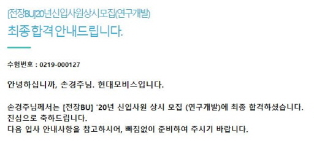

#  　

#  　

#  서론

#  　

* 길었던 취준이 드디어 끝났다. 20년 2월 1일에 토익스피킹 성적을 얻은 것을 시작으로 1년이 조금 넘는 시간이 흘렀다.

  정말 많은 인내가 있었고 도움이 있었고 기도가 있었다. 먼저는 취업 기간동안 인도하여 주시고 동행하여 주신 하나님께 영광돌립니다.

  또 긴 시간동안 참고 기다려준 가족들과 도움을 주신 교수님, 목사님 끝으로 자기 일처럼 함께 기도해주고 응원해준 우리 하음셀 정말 감사합니다.
  
#  　

# 스펙 및 합/불

#  　

## 스펙

* 숭실대학교 20년 8월 졸업
* 학점 : 4.3X
* 영어 : Toeic Speaking Lv.6
* 인턴, 경력 경험 X
* IoT 프로젝트 4회, 웹 페이지 제작 2회(Django), 교내 알고리즘 대회 동상, 안드로이드 어플 제작(사용자 약 50명)

#  　

## 합/불

* 20 상반기
  * 하이닉스 서류 - 인적성(탈)
  * 롯정통 서류 - 롯정통 인적성(L-TAB) - 롯정통 최종면접(탈)

